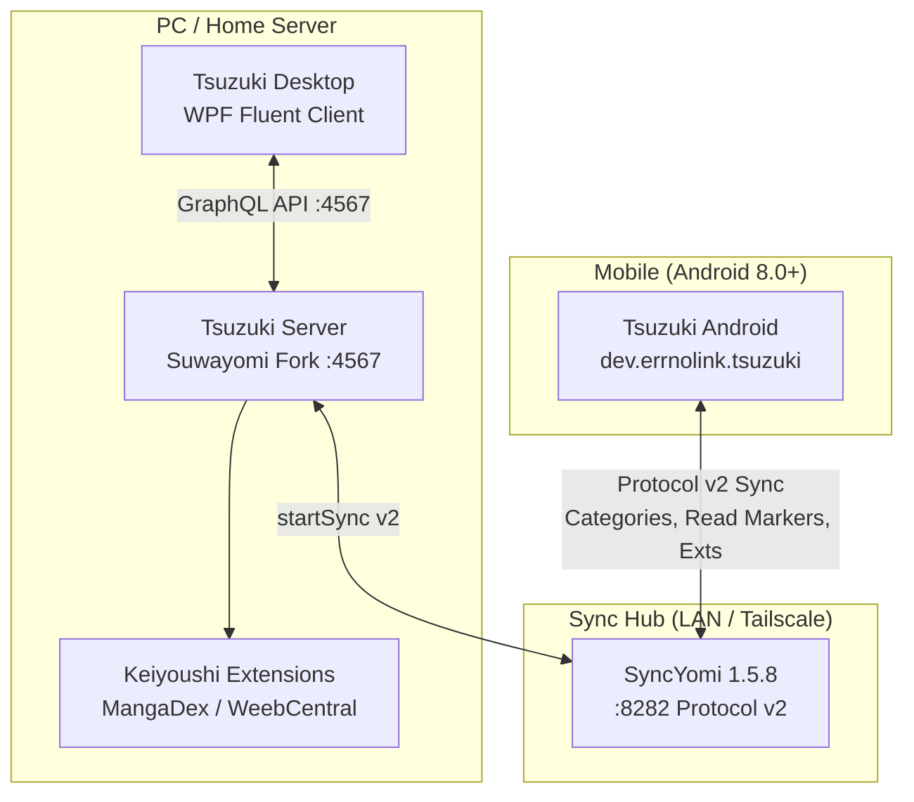

# Tsuzuki Android

A personal Android manga reader forked from **Komikku** (v1.14.1), featuring an iOS 27 Liquid Glass aesthetic, comprehensive **Neko** (MangaDex) parity, merged manga deduplication, and SyncYomi v2 continuation.

---

## Architecture Overview

Tsuzuki operates as a coordinated personal ecosystem. Android and Desktop connect through a local or Tailscale-hosted SyncYomi hub, while Tsuzuki Server manages extensions, downloads, and headless library operations.



---

## Features

### Verified and Present
* **Liquid Glass UI:** Centered compact floating glass tab capsule (Apple Photos inspired), floating glass action pills, large-title scrolling scaffolds, and translucent frosted surfaces powered by Haze 1.7.2 and Kyant Backdrop 1.0.6 (API 33+). Neutral system bars and theme-leak-free styling.
* **Upstream Architecture Isolation:** All presentation code lives in `dev.errnolink.tsuzuki.ui.*` behind thin hooks (`Routes.kt`). Upstream Komikku logic files remain pristine, enabling clean vendor branch merges.
* **Neko / MangaDex Parity:** Ported handlers from Neko 3.8.2 (`exh/md/**`): 2-way read status synchronization, custom MDLists, discover/feed shelves, per-volume cover-art gallery, author/group tracking, and aggregate chapter parsing.
* **Merged Manga (Source 6969):** Reads composite manga entries that unify multiple sources (e.g. MangaDex + WeebCentral), deduplicating chapters and routing reading progress to canonical entries.
* **SyncYomi Protocol v2:** Native client communicating over protocol v2, category UID reconciliation (migration 47), merged reference preservation (field 600), and automated progress pushes on reader exit.
* **Private Extension Installation:** Installs trusted extensions into app-private storage without requiring Android system package installer prompts.
* **Privacy & Telemetry Stripped:** All upstream analytics, Crashlytics, Firebase, remote updater checks, and third-party tracking have been removed.

### In Progress / Planned
* **Automatic Extension Sync Engine:** Android reconciliation for field 700 wanted-extensions payload (currently undergoing branch integration).
* **Minified Release Benchmark Profile:** Baseline profile tuning and Compose stability optimization for lower memory footprint during fast scrolls.


## Building from Source

### Prerequisites
* **JDK 21** (Temurin or OpenJDK recommended)
* **Android SDK** with `compileSdk 36`, `targetSdk 36`, and Android Build Tools installed
* Environment variables: `ANDROID_HOME` or `local.properties` pointing to your SDK

### Build Commands
```bash
# Debug build (packaged with dev suffix: dev.errnolink.tsuzuki.dev)
./gradlew :app:assembleDebug

# Release build (requires signing.properties configured)
./gradlew :app:assembleRelease
```

---

## Setup and Installation for Friends

### 1. Installing the APK
1. Download `tsuzuki-release.apk` (or the debug preview `Tsuzuki-preview.apk`) from the Releases page.
2. Sideload the APK onto your Android device (Android 8.0 or newer required).
3. If prompted, grant permission to "Install unknown apps" for your file manager or browser.

### 2. Sideloading MangaDex & WeebCentral Extensions
Tsuzuki does not bundle content sources. Use the community-maintained Keiyoushi extension repository:
1. Open Tsuzuki → **More** → **Settings** → **Browse** → **Extension Repositories**.
2. Add the Keiyoushi repository URL:
   `https://raw.githubusercontent.com/keiyoushi/extensions/repo/index.min.json`
3. Go to the **Browse** tab → **Extensions**.
4. Install **MangaDex** (v1.6.x) and **WeebCentral** (v1.6.x).
5. Open MangaDex settings if you wish to log in to your personal MangaDex account for synced follows.

### 3. Setting Up Sync
To synchronize your reading progress with your PC or home server:
1. Ensure your PC is running **SyncYomi 1.5.8** (listening on `:8282`).
2. If connecting across different networks, connect your phone and PC to the same **Tailscale** tailnet.
3. In Tsuzuki: **Settings** → **Data & storage** → **Sync**.
4. Enter the SyncYomi server URL (`http://<PC-LAN-OR-TAILSCALE-IP>:8282`) and your sync credentials.
5. Tap **Sync now** to perform the initial synchronization.

---

## Credits and Upstream Lineage

Tsuzuki Android is built on the shoulders of the open-source manga reading community:
* **[Komikku](https://github.com/komikku-app/komikku)** (by cuong-tran and contributors) — Our upstream base.
* **[TachiyomiSY](https://github.com/jobobby04/TachiyomiSY)** (by jobobby04 and contributors) — Merged manga and source extensions.
* **[Mihon](https://github.com/mihonapp/mihon)** & **[Tachiyomi](https://github.com/tachiyomiorg/tachiyomi)** (by Javier Tomás and contributors) — Core architecture, database models, and reader engine.
* **[Neko](https://github.com/CarlosEsco/Neko)** (by Carlos Escobedo and contributors) — MangaDex native integration and handler design.
* **[Haze](https://github.com/chrisbanes/haze)** (by Chris Banes) & **[Backdrop](https://github.com/Kyant0/Backdrop)** (by Kyant0) — Android blur and translucent glass shaders.

---

## License

Tsuzuki Android is licensed under the **Apache License, Version 2.0**.
See [LICENSE](LICENSE) and [NOTICE.md](NOTICE.md) for full license texts and detailed copyright notices.

---

## Disclaimer

This is a personal, non-commercial software project created for personal use and shared with friends. The developers of this application have zero affiliation with any content providers or web hosting platforms. The application hosts, provides, and distributes zero copyright material.
